# &nbsp; Volans 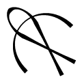{: width="80px" height="80px" style="float:left; padding:10px; text-align:center"}  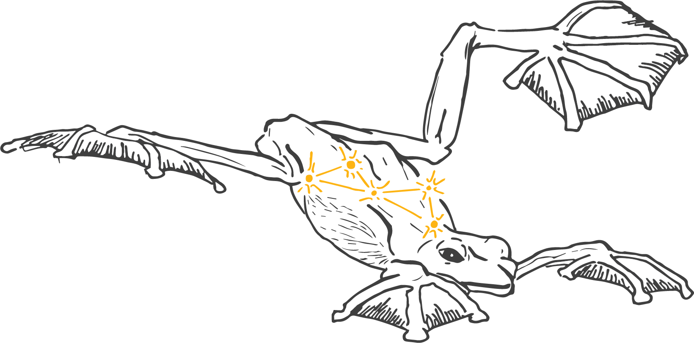{: height="40%" width="40%" style="float:right; padding:10px"}
&nbsp; **Dates**: April 22 - June 1  

[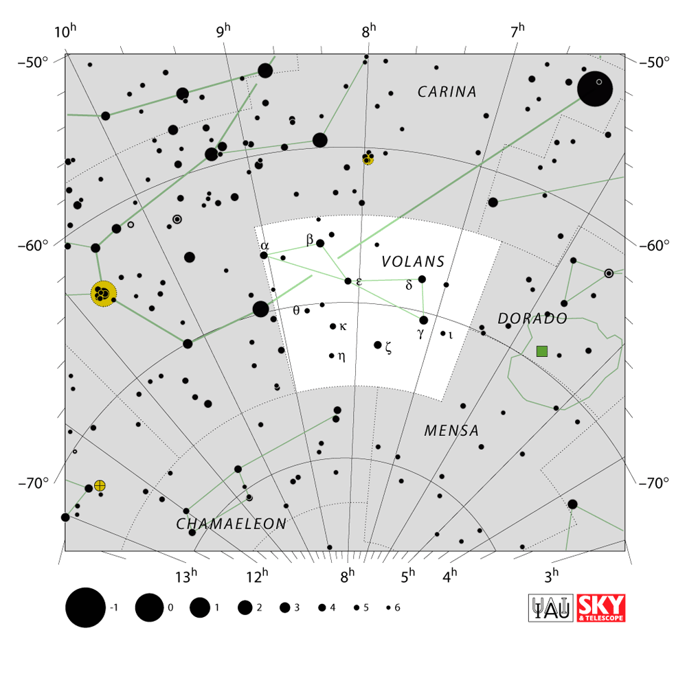{: width="350px" height="350px" style="float:right; padding:10px"}](https://en.wikipedia.org/wiki/Volans)  
   
**Description**: Volans are brave, and always striving for greater things. Volans often offer justice and protection when others cannot. Some may say that Volans are overconfident, but a Volans would simply state that they are guided by their convictions. However, their self-confidence can sometimes backfire with those who disagree with their opinions. Volans hang tight with Eridanus extroverts and clash with competitive Hercules. They are strongly attracted to their opposite, Lepus, with mixed success.  

**General Amphibian Characteristics**: Frogs that love spending their time in trees and bushes. 

**Amphibian Spiritual Guides**: [Hylidae](https://amphibiaweb.org/lists/Hylidae.shtml), [Rhacophoridae](https://amphibiaweb.org/lists/Rhacophoridae.shtml), [Centrolenidae](https://amphibiaweb.org/lists/Centrolenidae.shtml), [Sooglossidae](https://amphibiaweb.org/lists/Sooglossidae.shtml), [Hyperoliidae](https://amphibiaweb.org/lists/Hyperoliidae.shtml), [Allophrynidae](https://amphibiaweb.org/lists/Allophrynidae.shtml)

**Amphibian Archetypes**  
[*Agalychnis callidryas*](https://amphibiaweb.org/cgi/amphib_query?where-genus=Agalychnis&where-species=callidryas): the famous red-eyed tree frog  
[*Rhacophorus nigropalmatus*](https://amphibiaweb.org/cgi/amphib_query?where-scientific_name=Rhacophorus+nigropalmatus): this flying frog can leap from tree to tree with its webbed hands and feet  
[*Boana rosenbergi*](https://amphibiaweb.org/cgi/amphib_query?where-genus=Boana&where-species=rosenbergi): the gladiator tree frog, whose males fight with sharp spikes on their hands  

**Volans Celebrities**  
[David Attenborough](https://en.wikipedia.org/wiki/David_Attenborough): a British film-maker and natural historian  
[Rachel Carson](https://en.wikipedia.org/wiki/Rachel_Carson): author of Silent Spring, which advanced environmentalism  
[Ian McKellan](https://en.wikipedia.org/wiki/Ian_McKellen): English actor and Gandalf  
[Doris Mable Cochran](https://en.wikipedia.org/wiki/Doris_Mable_Cochran): American Herpetologist and custodian of American Natural Collection at the Smithsonian  
   

---
 
# &nbsp; Eridanus 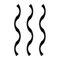{: width="80px" height="80px" style="float:left; padding:10px; text-align:center"}  

[{: width="350px" height="350px" style="float:right; padding:10px"}](https://en.wikipedia.org/wiki/Eridanus_(constellation))
&nbsp; **Dates**: June 2 - July 17 

**Description**: Known for their out-going and extroverted nature, Eridani are bright-eyed with a strong sense of adventure. They follow the beat of their own drum, which can be their greatest strength but also make it hard for others to relate. Eridanus loves to talk and collaborate with other creative spirits. They usually hit it off with Volans, are inspired by Phoenix, appreciate the support of Coma Berenices, and clash with Hercules and Scutum.  

**General Amphibian Characteristics**: Highly aquatic frogs, salamanders, and caecilians. 

**Amphibian Spiritual Guides**: [Leiopelmatidae](https://amphibiaweb.org/lists/Leiopelmatidae.shtml), [Pipidae](https://amphibiaweb.org/lists/Pipidae.shtml), [Bombinatoridae](https://amphibiaweb.org/lists/Bombinatoridae.shtml), [Telmatobiidae](https://amphibiaweb.org/lists/Telmatobiidae.shtml), [Amphiumidae](https://amphibiaweb.org/lists/Amphiumidae.shtml), [Sirenidae](https://amphibiaweb.org/lists/Sirenidae.shtml), [Proteidae](https://amphibiaweb.org/lists/Proteidae.shtml), [Nyctibatrachidae](https://amphibiaweb.org/lists/Nyctibatrachidae.shtml), [Typhlonectidae](https://amphibiaweb.org/lists/Typhlonectidae.shtml), [Heleophrynidae](https://amphibiaweb.org/lists/Heleophrynidae.shtml), [Rhinodermatidae](https://amphibiaweb.org/lists/Rhinodermatidae.shtml), [Cycloramphidae](https://amphibiaweb.org/lists/Cycloramphidae.shtml), [Hylodidae](https://amphibiaweb.org/lists/Hylodidae.shtml), [Alsodidae](https://amphibiaweb.org/lists/Alsodidae.shtml), [Batrachylidae](https://amphibiaweb.org/lists/Batrachylidae.shtml), [Petropedetidae](https://amphibiaweb.org/lists/Petropedetidae.shtml), [Ascaphidae](https://amphibiaweb.org/lists/Ascaphidae.shtml), [Rhyacotritonidae](https://amphibiaweb.org/lists/Rhyacotritonidae.shtml), [Ranidae](https://amphibiaweb.org/lists/Ranidae.shtml)

**Amphibian Archetypes**  
[*Ascaphus truei*](https://amphibiaweb.org/cgi/amphib_query?where-genus=Ascaphus&where-species=truei): a stream- or torrent-dwelling frog with tadpoles that have a suction mouth that allows them to cling to rocks  
[*Typhlonectes natans*](https://amphibiaweb.org/cgi/amphib_query?where-genus=Typhlonectes&where-species=natans): an aquatic-burrowing caecilian  
[*Proteus anguinus*](https://amphibiaweb.org/cgi/amphib_query?where-genus=Proteus&where-species=anguinus): also known as the olm, an underwater cave-dwelling salamander that has been known to stay in one spot for years on end  
[*Pipa pipa*](https://amphibiaweb.org/cgi/amphib_query?where-genus=Pipa&where-species=pipa): flat, extreme aquatic frog that hatches its eggs out of the female’s back  
[*Xenopus laevis*](https://amphibiaweb.org/cgi/amphib_query?where-genus=Xenopus&where-species=laevis): aquatic clawed frog that was introduced to the U.S. as a pregnancy test  

**Eridanus Celebrities**  
[David Wake](https://en.wikipedia.org/wiki/David_B._Wake): salamander biologist and founder of AmphibiaWeb  
[John William Daly](https://www.ncbi.nlm.nih.gov/pmc/articles/PMC4493916/): biochemist who helped make poison frogs famous  
[Helen Rodríguez Trías](https://en.wikipedia.org/wiki/Helen_Rodr%C3%ADguez_Tr%C3%ADas): doctor, educator, and women's rights activist  
[Meryl Streep](https://en.wikipedia.org/wiki/Meryl_Streep): American actress  
[James L. Patton](https://en.wikipedia.org/wiki/James_L._Patton): American evolutionary biologist and mammologist  
   

---
 
# &nbsp; Scutum 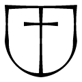{: width="80px" height="80px" style="float:left; padding:10px; text-align:center"}  

[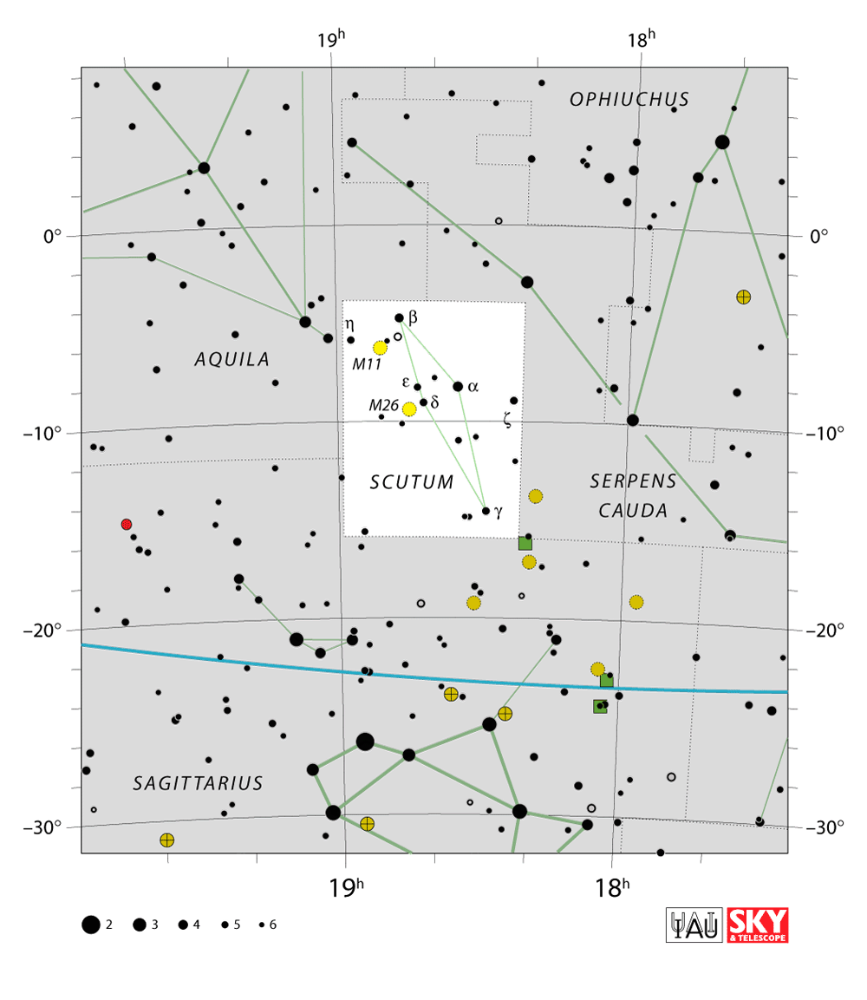{: width="350px" height="350px" style="float:right; padding:10px"}](https://en.wikipedia.org/wiki/Scutum_(constellation))
&nbsp; **Dates**: July 18 - September 1 

**Description**: Scuta are known as the protectors. They are loyal and strong; it is well worth the effort to get to know one. Scuta are often warm and welcoming once you get past their external barriers. Given their tenacity, Scuta are driven to scheme for success, often coming up with surprising solutions to difficult problems. Scutum individuals have the most difficulty relating to Eridanus and Volans, though they get along well with Hercules and Lepus. 
  
**General Amphibian Characteristics**: Bumpy toads, rough skinned newts, and terrestrial caecilians. 

**Amphibian Spiritual Guides**: [Bufonidae](https://amphibiaweb.org/lists/Bufonidae.shtml), [Megophryidae](https://amphibiaweb.org/lists/Megophryidae.shtml), [Brachycephalidae](https://amphibiaweb.org/lists/Brachycephalidae.shtml), [Alytidae](https://amphibiaweb.org/lists/Alytidae.shtml), [Salamandridae](https://amphibiaweb.org/lists/Salamandridae.shtml), [Caeciliidae](https://amphibiaweb.org/lists/Caeciliidae.shtml)

**Amphibian Archetypes**  
[*Bufo bufo*](https://amphibiaweb.org/cgi/amphib_query?where-genus=Bufo&where-species=bufo): a common toad with bulky poison glands  
[*Megophrys nasuta*](https://amphibiaweb.org/cgi/amphib_query?where-genus=Megophrys&where-species=nasuta): a large-bodied frog that mimics dead leaves  
[*Taricha torosa*](https://amphibiaweb.org/cgi/amphib_query?where-genus=Taricha&where-species=torosa): toxic salamander that shows off bright orange belly in unken reflex  
[*Caecilia thompsoni*](https://amphibiaweb.org/cgi/amphib_query?where-genus=Caecilia&where-species=thompsoni): the largest caecilian  

**Scutum Celebrities**  
[Rosalind Franklin](https://en.wikipedia.org/wiki/Rosalind_Franklin): chemist whose work solved the structure of DNA  
[Marvalee Wake](https://en.wikipedia.org/wiki/Marvalee_Wake): caecilian biologist and influential herpetologist   
[Taika Waititi](https://en.wikipedia.org/wiki/Taika_Waititi): New Zealand film director and actor  
[Henrietta Lacks](https://en.wikipedia.org/wiki/Henrietta_Lacks): African-American woman whose cells became the first immortal cell line, HeLa    
[Katherine Johnson](https://en.wikipedia.org/wiki/Katherine_Johnson): NASA research mathematician  
[Lydia Villa-Komaroff](https://en.wikipedia.org/wiki/Lydia_Villa-Komaroff): co-founder of Society for the Advancement of Chicanos/Hispanics and Native Americans in Science (SACNAS)
   

---
 
# &nbsp; Hercules 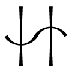{: width="80px" height="80px" style="float:left; padding:10px; text-align:center"}  

&nbsp; **Dates**: September 2 - October 17
[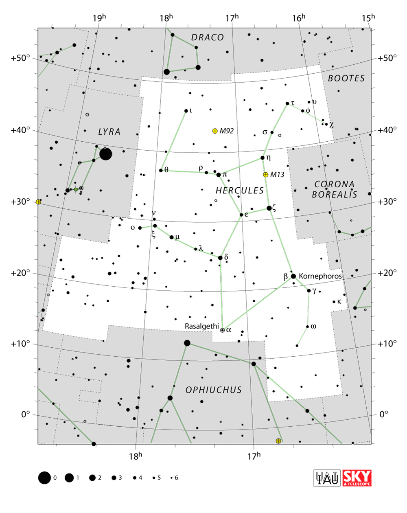{: width="350px" height="350px" style="float:right; padding:10px"}](https://en.wikipedia.org/wiki/Hercules_(constellation))

**Description**: Hercules are powerful, deliberate, and competent. They put a lot of effort into achieving their personal and collective goals, and are thus often admired by those surrounding them. Hercules love to fight for just causes and they are always on the side of the downtrodden. A great sense of humor and competitive spirit make Hercules fun and entertaining when relaxed. Hercules easily bond with other competitive spirits like Scutum. They should be careful not to be too overbearing when in relationships with Circinus and Eriadanus. Volans, Phoenix, and Scutum -- on the other hand -- find the strength of will in Hercules invigorating.  

**General Amphibian Characteristics**: Giant salamanders, buff frogs, and brightly colored small frogs that pack a toxic punch. 

**Amphibian Spiritual Guides**: [Cryptobranchidae](https://amphibiaweb.org/lists/Cryptobranchidae.shtml), [Conrauidae](https://amphibiaweb.org/lists/Conrauidae.shtml), [Pyxicephalidae](https://amphibiaweb.org/lists/Pyxicephalidae.shtml), [Ceratophryidae](https://amphibiaweb.org/lists/Ceratophryidae.shtml), [Dicamptodontidae](https://amphibiaweb.org/lists/Dicamptodontidae.shtml), [Ambystomatidae](https://amphibiaweb.org/lists/Ambystomatidae.shtml),
[Calyptocephalellidae](https://amphibiaweb.org/lists/Calyptocephalellidae.shtml), [Dendrobatidae](https://amphibiaweb.org/lists/Dendrobatidae.shtml), [Odontophrynidae](https://amphibiaweb.org/lists/Odontophrynidae.shtml)

**Amphibian Archetypes**  
[*Cryptobranchus alleganiensis*](https://amphibiaweb.org/cgi/amphib_query?where-genus=Cryptobranchus&where-species=alleganiensis): large, aquatic salamander, also known as the hellbender salamander 
[*Dendrobates auratus*](https://amphibiaweb.org/cgi/amphib_query?where-genus=Dendrobates&where-species=auratus): striking green-and-black poison dart frog, its strength is its toxicity  
[*Conraua goliath*](https://amphibiaweb.org/cgi/amphib_query?where-genus=Conraua&where-species=goliath): the largest frog in the world, also known as the goliath bullfrog and the giant slippery frog  

**Hercules Celebrities**  
[Neil deGrasse Tyson](https://en.wikipedia.org/wiki/Neil_deGrasse_Tyson): American astrophysicist  
[Mae Jemison](https://en.wikipedia.org/wiki/Mae_Jemison): first Black woman in space  
[Tomoko Ohta](https://en.wikipedia.org/wiki/Tomoko_Ohta): Japanese population geneticist  
[Alexander Von Humboldt](https://en.wikipedia.org/wiki/Alexander_von_Humboldt): Prussian polymath, geographer, naturalist, and explorer  
[Francisco Jose de Caldas](https://en.wikipedia.org/wiki/Francisco_Jos%C3%A9_de_Caldas): Colombian scientist, naturalist, and biogeographer  
   

---
 
# &nbsp; Phoenix 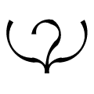{: width="80px" height="80px" style="float:left; padding:10px; text-align:center"}  

&nbsp; **Dates**: October 18 - December 2  
[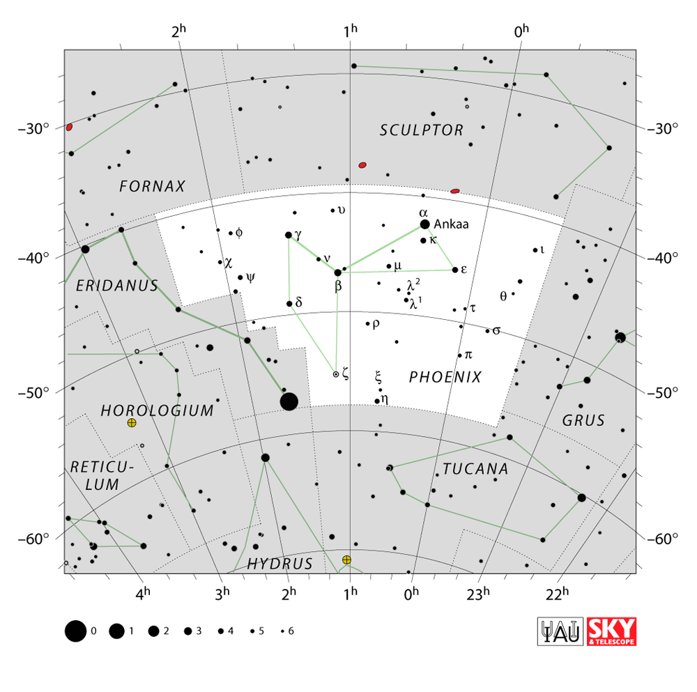{: width="350px" height="350px" style="float:right; padding:10px"}](https://en.wikipedia.org/wiki/Phoenix_(constellation))

**Description**: Phoenix are born ready to follow their dreams. They are often perceived as mature and serious, but Phoenix can be tender and vulnerable when feeling comfortable. They had to grow up quickly, which is why it is sometimes difficult for them to unwind. Nevertheless, their curiosity drives them to keep learning and they are willing to change. Phoenix happily get along with those who don’t get in their way, like Eridanus or Scutum (when these tenacious individuals are on a separate path).  

**General Amphibian Characteristics**: Frogs and salamanders that are direct developers, meaning that they don’t have tadpole or larval stages and look like tiny adults when they hatch. 

**Amphibian Spiritual Guides**: [Craugastoridae](https://amphibiaweb.org/lists/Craugastoridae.shtml), [Strabomantidae](https://amphibiaweb.org/lists/Strabomantidae.shtml), [Eleutherodactylidae](https://amphibiaweb.org/lists/Eleutherodactylidae.shtml), [Ceuthomantidae](https://amphibiaweb.org/lists/Ceuthomantidae.shtml), [Plethodontidae](https://amphibiaweb.org/lists/Plethodontidae.shtml), [Ceratobatrachidae](https://amphibiaweb.org/lists/Ceratobatrachidae.shtml)  

**Amphibian Archetypes**  
[*Aneides lugubris*](https://amphibiaweb.org/cgi/amphib_query?where-genus=Aneides&where-species=lugubris): climbing salamander with a tendency to bite people who pick them up   
[*Eleutherodactylus iberia*](https://amphibiaweb.org/cgi/amphib_query?where-genus=Eleutherodactylus&where-species=iberia): the smallest frog in the Northern Hemisphere  
[*Cornufer guentheri*](https://amphibiaweb.org/cgi/amphib_query?where-genus=Cornufer&where-species=guentheri): leaf frog that blends in with the forest floor  

**Pheonix Celebrities**  
[Bill Nye](https://en.wikipedia.org/wiki/Bill_Nye): "the science guy"  
[Chadwick Boseman](https://en.wikipedia.org/wiki/Chadwick_Boseman): African-American actor  
[Janaki Ammal](https://en.wikipedia.org/wiki/Janaki_Ammal): the first Indian woman to get a PhD in botany in the US  
[Lise Meitner](https://en.wikipedia.org/wiki/Lise_Meitner): Austrian-Swedish physicist for whom the element meitnerium is named  
[Rafael Pombo](https://en.wikipedia.org/wiki/Rafael_Pombo) 19st century colombian poet, children book literature writer, mathematician and engineer  
[Marie Curie](https://en.wikipedia.org/wiki/Marie_Curie): Polish and naturalized French physicist and chemist  
   

---
 
# &nbsp; Lepus 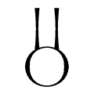{: width="80px" height="80px" style="float:left; padding:10px; text-align:center"}  

&nbsp; **Dates**: December 3 - January 17 
[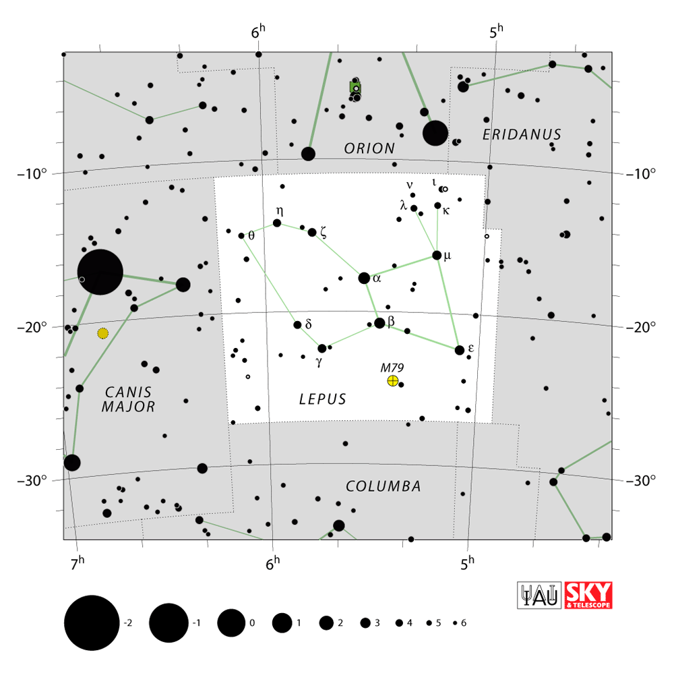{: width="350px" height="350px" style="float:right; padding:10px"}](https://en.wikipedia.org/wiki/Lepus_(constellation))

**Description**: Lepus are “grounded” and operate beneath the surface of the mainstream. They are innovative, finding unconventional ways to achieve their goals. Lepus are generally quiet but can be loud when speaking their mind. They do not like the limelight and prefer to judge others on their character rather than their appearance. Lepus do not mind getting dirty but shy away from confrontation. Lepus like spending quiet time with other people, and thus get along well with Coma Berenices. They like having Hercules around to help them fight their battles, and they find their opposite Volans, whom they get along with some of the time, fascinating.    

**General Amphibian Characteristics**: Caecilians and globose frogs that spend most of their time underground. 

**Amphibian Spiritual Guides**: [Microhylidae](https://amphibiaweb.org/lists/Microhylidae.shtml), [Scaphiopodidae](https://amphibiaweb.org/lists/Scaphiopodidae.shtml), [Pelodytidae](https://amphibiaweb.org/lists/Pelodytidae.shtml), [Pelobatidae](https://amphibiaweb.org/lists/Pelobatidae.shtml), [Rhinophrynidae](https://amphibiaweb.org/lists/Rhinophrynidae.shtml), [Nasikabatrachidae](https://amphibiaweb.org/lists/Nasikabatrachidae.shtml),
[Brevicipiditae](https://amphibiaweb.org/lists/Brevicipiditae.shtml), [Hemisotidae](https://amphibiaweb.org/lists/Hemisotidae.shtml), [Ichthyophiidae](https://amphibiaweb.org/lists/Ichthyophiidae.shtml),
[Rhinatrematidae](https://amphibiaweb.org/lists/Rhinatrematidae.shtml), [Scolecomorphidae](https://amphibiaweb.org/lists/Scolecomorphidae.shtml), [Chikilidae](https://amphibiaweb.org/lists/Chikilidae.shtml),
[Herpelidae](https://amphibiaweb.org/lists/Herpelidae.shtml)    

**Amphibian Archetypes**  
[*Scaphiopus couchii*](https://amphibiaweb.org/cgi/amphib_query?where-genus=Scaphiopus&where-species=couchii): toads that burrow with the spades on their feet   
[*Boulengerula taitana*](https://amphibiaweb.org/cgi/amphib_query?where-genus=Boulengerula&where-species=taitana): caecilian that lives underground, mother’s grow lipid-rich skin for their young to eat  
[*Rhinophrynus dorsalis*](https://amphibiaweb.org/cgi/amphib_query?where-genus=Rhinophrynus&where-species=dorsalis): the Mexican burrowing toad has a snout that is suited for burrowing and seeking ants and termites underground  
[*Breviceps macrops*](https://amphibiaweb.org/cgi/amphib_query?where-genus=Breviceps&where-species=macrops): the desert rain frog has a famous squeaky-toy-like call  

**Lepus Celebrities**  
[Alfred Russel Wallace](https://en.wikipedia.org/wiki/Alfred_Russel_Wallace): father of biogeography and the theory of evolution by natural selection (alongside Charles Darwin)   
[Judi Dench](https://en.wikipedia.org/wiki/Judi_Dench): English actress    
[Annie Alexander](https://en.wikipedia.org/wiki/Annie_Montague_Alexander): founder of the Museum of Vertebrate Zoology at the University of California Berkeley  
[Misael Acosta Solis](https://en.wikipedia.org/wiki/Misael_Acosta_Sol%C3%ADs): Ecuadorian naturalist and botanist  
   

---
 
# &nbsp; Circinus 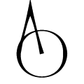{: width="80px" height="80px" style="float:left; padding:10px; text-align:center"}  

[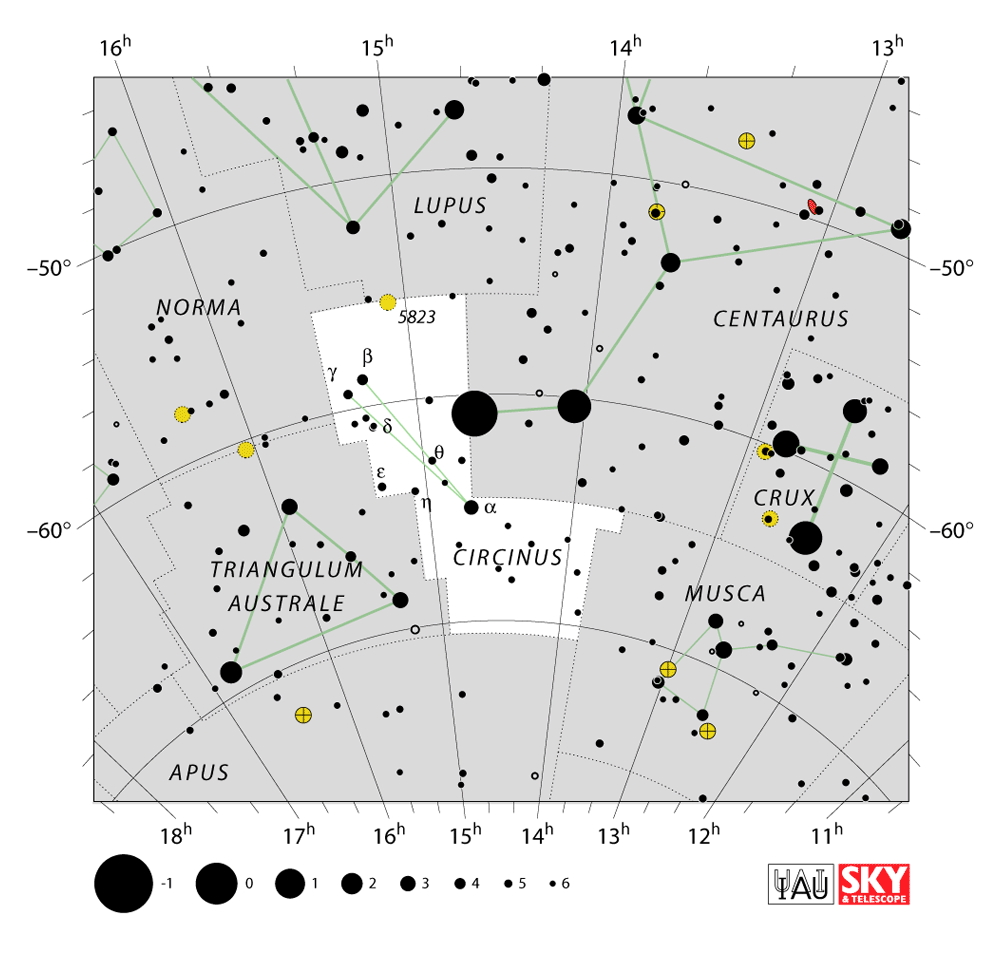{: width="350px" height="350px" style="float:right; padding:10px"}](https://en.wikipedia.org/wiki/Circinus)
&nbsp; **Dates**: January 18 - March 4

**Description**: Circinus are wanderers who simultaneously seek their place in the world and are satisfied with not knowing  where that might be. They do not agree with conventional ideas of success and like to explore and enjoy life in different manners. Sometimes they will go with the flow, and other times they will make quick decisions; in general, Circinus are difficult to predict! Creative, inquisitive, and fun, Circinus tends to get along well with Eridanus, enjoy deep conversations with Phoenix, and make great partners of Lepus. Circinus do not take well to the more competitive spirits like Hercules and Scutum.    

**General Amphibian Characteristics**: A diverse group of frogs and salamanders that have no unifying feature outside of their variability! 

**Amphibian Spiritual Guides**: [Myobatrachidae](https://amphibiaweb.org/lists/Myobatrachidae.shtml), [Hynobiidae](https://amphibiaweb.org/lists/Hynobiidae.shtml), [Ptychadenidae](https://amphibiaweb.org/lists/Ptychadenidae.shtml), [Leptodactylidae](https://amphibiaweb.org/lists/Leptodactylidae.shtml), [Dicroglossidae](https://amphibiaweb.org/lists/Dicroglossidae.shtml)  

**Amphibian Archetypes**  
[*Rheobatrachus silus*](https://amphibiaweb.org/cgi/amphib_query?where-genus=Rheobatrachus&where-species=silus): the gastric-brooding frog holds young in the stomach and gives birth through the mouth   
[*Myobatrachus gouldii*](https://amphibiaweb.org/cgi/amphib_query?where-genus=Myobatrachus&where-species=gouldii): the turtle frog has short, muscular limbs for digging in the sand  
[*Leptodactylus fallax*](https://amphibiaweb.org/cgi/amphib_query?where-genus=Leptodactylus&where-species=fallax): the mountain chicken is a large frog known to taste like the poultry for which it is named  

**Circinus Celebrities**  
[Lupita Nyong'o](https://en.wikipedia.org/wiki/Lupita_Nyong%27o): Kenyan-Mexican actress and author  
[Steve Irwin](https://en.wikipedia.org/wiki/Steve_Irwin): the "crocodile hunter"  
[Charles Darwin](https://en.wikipedia.org/wiki/Judi_Dench): English naturalist whose book On the Origin of Species describes the theory of evolution by natural selection.  
[Jennifer Doudna](https://en.wikipedia.org/wiki/Jennifer_Doudna): American biochemist famous for developing CRISPR technologies   
[Alice Eastwood](https://en.wikipedia.org/wiki/Alice_Eastwood): Canadian-American botanist for whom 17 species are named   
   

---
 
# &nbsp; Coma Berenices 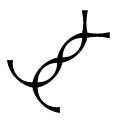{: width="80px" height="80px" style="float:left; padding:10px; text-align:center"}  

[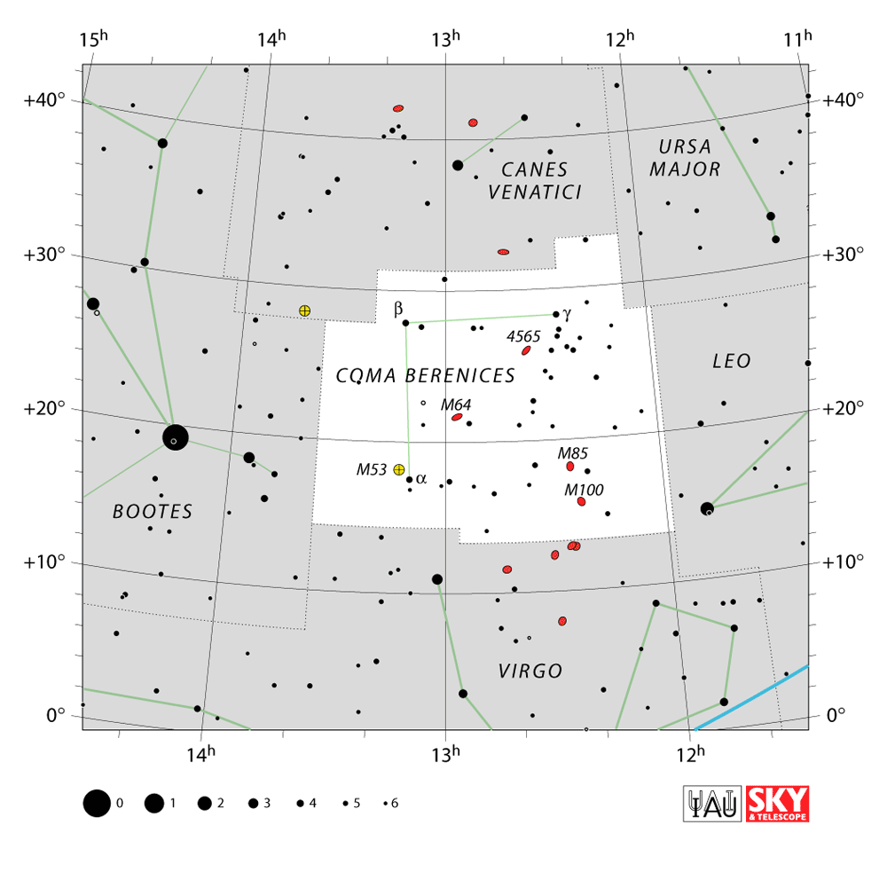{: width="350px" height="350px" style="float:right; padding:10px"}](https://en.wikipedia.org/wiki/Coma_Berenices)
&nbsp; **Dates**: March 5 - April 21

**Description**: Coma Berenices truly understand the interconnectedness of life, and they care deeply for the people they are connected to. They will take drastic action for people they love. Coma Berenices are loyal and attentive to their loved ones, yet they can be oblivious to the concerns of individuals outside their inner circles. They speak up for what they believe in but do not always know how to do it tactfully. Coma Berenices are happy to guide individuals like Circinus or boost the ambitions of Phoenix, but they clash with flighty Volans and non-conforming Eridanus.    

**General Amphibian Characteristics**: Frogs that live among the fallen leaves on the forest floor. Some are very loud squeakers! 

**Amphibian Spiritual Guides**: [Hemiphractidae](https://amphibiaweb.org/lists/Hemiphractidae.shtml), [Arthroleptidae](https://amphibiaweb.org/lists/Arthroleptidae.shtml), [Phrynobatrachidae](https://amphibiaweb.org/lists/Phrynobatrachidae.shtml), [Ranixalidae](https://amphibiaweb.org/lists/Ranixalidae.shtml), [Mantellidae](https://amphibiaweb.org/lists/Mantellidae.shtml)  

**Amphibian Archetypes**  
[*Mantella aurantiaca*](https://amphibiaweb.org/cgi/amphib_query?where-genus=Mantella&where-species=aurantiaca): a golden frog with aposematic coloration to signal the toxins it wields   
[*Trichobatrachus robustus*](https://amphibiaweb.org/cgi/amphib_query?where-genus=Trichobatrachus&where-species=robustus): the male hairy frog has thin skin protuberances on their legs that give them their common name      
[*Gastrotheca cornuta*](https://amphibiaweb.org/cgi/amphib_query?where-genus=Gastrotheca&where-species=cornuta): female horned marsupial frogs carry eggs on their backs  

**Coma Berenices Celebrities**  
[Mary Jackson](https://en.wikipedia.org/wiki/Mary_Jackson_(engineer)): NASA mathematician and engineer  
[Lynn Margulis](https://en.wikipedia.org/wiki/Lynn_Margulis): American evolutionary theorist who proposed that symbiosis led to the origin of cell organelles  
[Robert Downey Jr.](https://en.wikipedia.org/wiki/Robert_Downey_Jr.): American actor best known for his role as Iron Man in Marvel films  
[Albert Einstein](https://en.wikipedia.org/wiki/Albert_Einstein): German theoretical physicist  
[Johann Sebastian Bach](https://en.wikipedia.org/wiki/Johann_Sebastian_Bach): German composer and musician  

